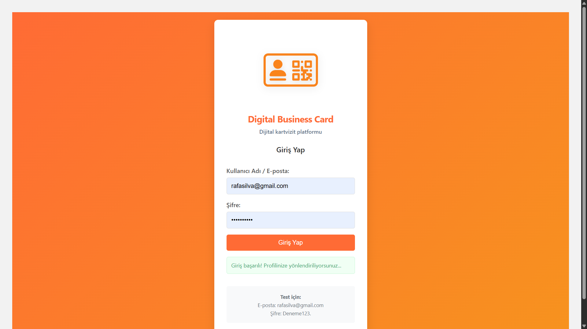
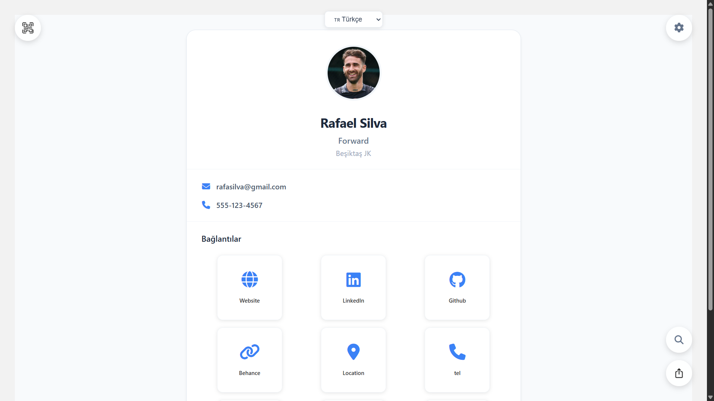
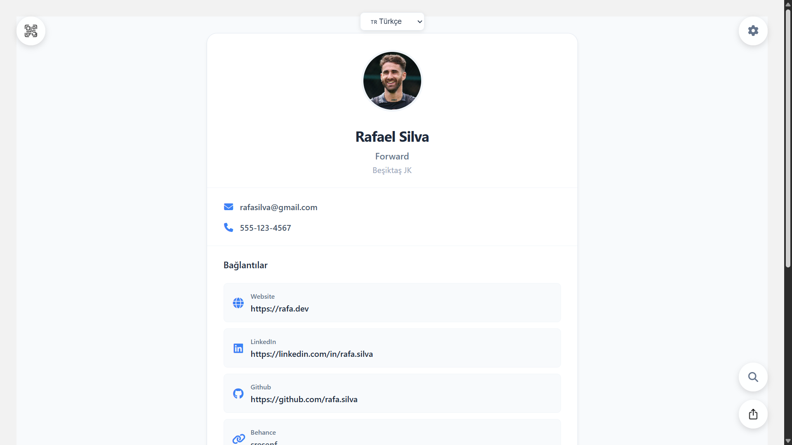
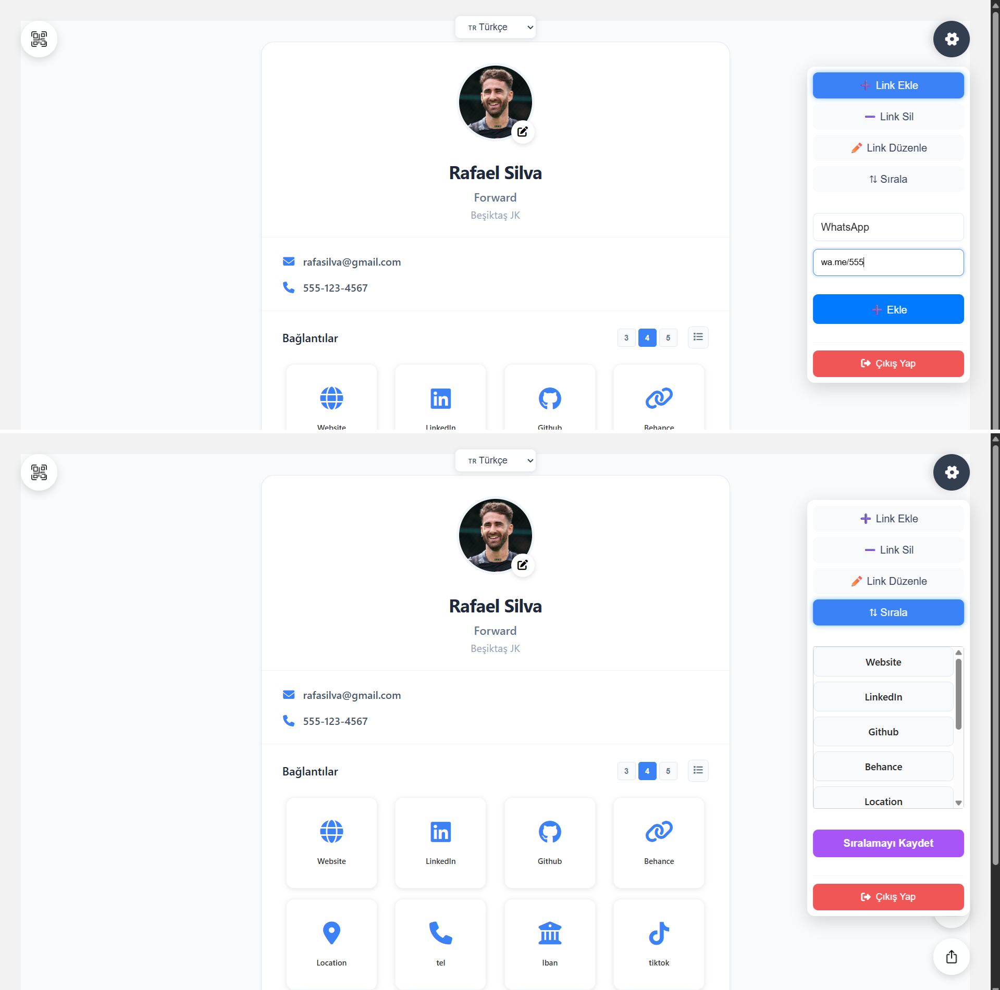

# Digital Business Card

**Digital Business Card**, kullanıcıların kendi dijital kartvizitlerini kolayca oluşturup paylaşmalarını sağlayan şık ve kullanıcı dostu bir web uygulamasıdır. Temel özellikleri şunlardır:

- **Profil Fotoğrafı Yükleme:** Kullanıcılar, kendilerine ait bir profil fotoğrafını yükleyerek kartvizitlerine kişisel bir dokunuş katabilir.  
- **Dijital Hesap Linkleri:** Sosyal medya (LinkedIn, Twitter, Instagram vb.), e-posta, web sitesi ve diğer dijital platform hesaplarını bir arada ekleyebilir; ziyaretçiler tek tıkla ilgili profillere yönlendirilebilir.  
- **Özelleştirilebilir Tasarım:** Renk şeması, yazı tipi ve düzen seçenekleri ile her kart vizit kullanıcıya özgü bir görünüm sunar.  
- **Kullanıcıya Özel URL:** Her kartvizite benzersiz bir kısa bağlantı (ör. `yourname.digitalcard.com/abc123`) atanır; bu sayede kolayca paylaşılabilir.  
- **QR Kod Desteği:** Kartvizit URL’si otomatik olarak oluşturulan QR kod ile birlikte sunulur; basılı materyallerde veya etkinliklerde taratılarak hızlı erişim sağlanır.  
- **Mobil Uyumluluk:** Tamamen responsive tasarımıyla hem masaüstü hem de mobil cihazlarda sorunsuz görüntülenir.  
- **Gizlilik ve Güvenlik:** Kullanıcı verileri güvenli bir şekilde saklanır; istenirse kartvizit yalnızca davet yoluyla veya parola korumalı olarak paylaşılabilir.  

Bu özellikler sayesinde, fiziksel kartvizitlere gerek kalmadan, profesyonel ve modern bir ortamda kendinizi ve iletişim bilgilerinizi etkili biçimde tanıtabilirsiniz.

## Screenshots

### Login Ekranı


*Login ekranı*  

### Profil Kartı Grid


*Kullanıcının dijital kartvizit grid layout görünümü*

### Profil Kartı List


*Kullanıcının dijital kartvizit list layout görünümü*

### Ayarlar Menüsü


*Kullanıcının kendi profilinde yapacağı örnek bağlantı ve profil düzenlemeleri*

## 📋 Özellik Durumu

- [x] **QR Kod Entegrasyonu** - Dinamik QR kod oluşturma ve paylaşım
- [x] **Özelleştirilebilir Unique Link** - Kişisel URL'ler
- [x] **Sınırsız Link Ekleme** - Sosyal medya ve iletişim linkleri
- [x] **Private Profil Sistemi** - Şifre korumalı erişim
- [x] **Özel Erişim Linkleri** - Zaman sınırlı paylaşım
- [x] **Responsive Tasarım** - Tüm cihazlarda uyumlu
- [x] **Multi-language Support** - Çoklu dil desteği
- [x] **Grid/List Layout** - Esnek görünüm seçenekleri
- [x] **Profil Ziyaretçi Loglaması** - Analytics ve istatistikler
- [ ] **Profil bazlı tasarım tercihleri** - Arka plan fotoğrafı, renk yazı fontu gibi profile özgü tercihler

## 🔧 Gereksinimler

**Development Environment:**

- **.NET 8 SDK** - Backend API için
- **Node.js (v18+)** - Frontend geliştirme için
- **npm** - Paket yöneticisi
- **Angular CLI (v18+)** - Angular uygulaması için
- **PostgreSQL** - Veritabanı

**Production Environment:**

- **Web Server** - IIS, Nginx veya Apache
- **PostgreSQL Server** - Production veritabanı
- **SSL Certificate** - HTTPS için (önerilen)

## 🚀 Kurulum

### 1. Backend (API) Kurulumu

```bash
# Bağımlılıkları yükle
dotnet restore

# Veritabanı connection string'ini appsettings.json'da ayarla
# Migration'ları çalıştır
dotnet ef database update

# Backend'i başlat
dotnet run
```

### 2. Frontend (Angular) Kurulumu

```bash
# Frontend klasörüne geç
cd Frontend

# Bağımlılıkları yükle
npm install

# Development server'ı başlat
ng serve
```

## Proje Hiyerarşisi

```text
digital-business-card/
├── Controllers/                # .NET API controller dosyaları
│   ├── AuthController.cs
│   ├── UserDefinitionValuesController.cs
│   ├── DefinitionsController.cs
│   └── ProfileController.cs
├── Data/                       # DbContext ve veri erişim katmanı
│   ├── AppDbContext.cs
│   └── AppDbContextFactory.cs
├── Models/                     # Veri modelleri
│   ├── User.cs
│   ├── UserDefinitionValue.cs
│   ├── GlobalDefinition.cs
│   ├── CustomDefinition.cs
│   └── UpdateLinkRequest.cs
├── Migrations/                 # EF Core migration dosyaları
├── Frontend/                   # Angular uygulaması
│   ├── src/app/components/     # Angular bileşenleri
│   ├── src/app/models/         # Angular modelleri
│   ├── src/app/services/       # Angular servisleri
│   └── README.md               # Frontend özel dökümanı
├── wwwroot/                    # Statik dosyalar (profil fotoğrafları vb.)
├── docs/                       # Proje dokümantasyonu (varsa)
├── src/
│   └── mobile/                 # Flutter mobil uygulama
├── appsettings.json            # API yapılandırma dosyası
├── Program.cs                  # .NET giriş noktası
├── digital-business-card.csproj# Proje dosyası
└── README.md                   # Ana proje açıklamaları
```

## Contributing

Fork the repository

Create a feature branch
git checkout -b feature/amazing-feature

Make your changes

Add tests for new functionality

Commit your changes
git commit -m 'Add amazing feature'

Push to the branch
git push origin feature/amazing-feature

Open a Pull Request
